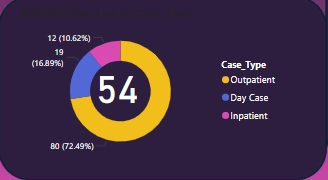
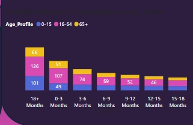
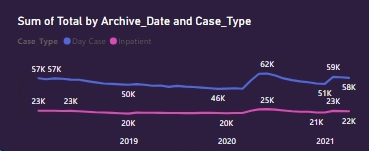
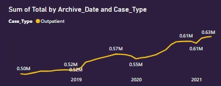
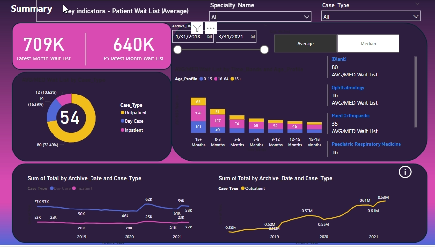

# Health-Center

# Introduction
The provided dashboard visualizes patient waitlist data for a healthcare facility, focusing on trends, breakdowns by case type, age profiles, and comparisons over time. The goal of this dashboard is to help healthcare administrators and policymakers make data-driven decisions to improve patient flow and resource allocation.

**_Disclaimer_** : _All data set do not represent any company, institution or country, but just a dummy data set to demonstrate the capabilities of power BI._

## Problem Statement
Managing patient wait times is a critical challenge for healthcare facilities, as prolonged wait times can lead to patient dissatisfaction, delayed care, and resource inefficiencies. The dashboard addresses the need for better insights into patient waitlists by highlighting key metrics such as case type distribution, age-group wait times, and year-over-year trends.

## Data Sourcing
The data used for this dashboard was obtained from the facility’s patient management system. It includes:

Patient Waitlist Records: Covering data from January 2018 to March 2021.
Key Variables: Archive dates, case types (Outpatient, Day Case, Inpatient), patient age profiles, and specialty names.
Historical Comparisons: Monthly and yearly aggregated statistics.

## Data Transformation
Data Transformation
To create meaningful insights, the raw data underwent the following transformation steps:

Data Cleaning: Removal of duplicates and records with missing values.
Aggregation: Monthly and yearly totals were calculated for patient waitlists and broken down by case type.
Categorization: Patients were grouped by age categories (0-15, 16-64, 65+) and case types.
Derivation of Metrics: Metrics such as “Latest Month Wait List” and “PY Latest Month Wait List” were calculated for comparative analysis.
Time-Series Analysis: Trends over time were visualized using cumulative sums for case types.

## Analysis and Visualization.
With the aid of pie charts, bar charts, and line graphs, I presented the total Wait list, case types and Age profile of patients.

### Total Wait List

  ---

  ### Total Case Types

  ---
  
  ### Age Profile of Patients

  ---

  ### Sum of Total by Achive Date and Case Type (Inpatient, Day Case)

  ---

   ### Sum of Total by Achive Date and Case Type(Outpatient)

  ---

  ### Health Care Dashboard

  ---

  # Conclusion
The dashboard provides actionable insights, including:

Current Waitlist Metrics: The latest month shows a waitlist of 709K patients, up from 640K in the previous year.
Case Type Distribution: The majority of cases fall under the inpatient category (72.49%).
Age Profile Insights: Waitlist durations vary significantly by age group, with notable challenges in the 16-64 age bracket.
Specialty-Specific Trends: Specialties such as Ophthalmology and Pediatric Orthopedics have high waitlist averages

# Recommendation
To address the identified issues:

Optimize Resource Allocation: Prioritize resource distribution for high-demand specialties and case types.
Focus on Critical Age Groups: Develop targeted strategies for the 16-64 age group to reduce waitlist times.
Implement Predictive Analytics: Use historical trends to predict future patient volumes and plan staffing and facilities accordingly.
Improve Workflow Efficiency: Adopt technology solutions to streamline patient scheduling and reduce bottlenecks.
This dashboard serves as a starting point for continuous monitoring and improvement of healthcare waitlist management practices.
THANK YOU 😄
